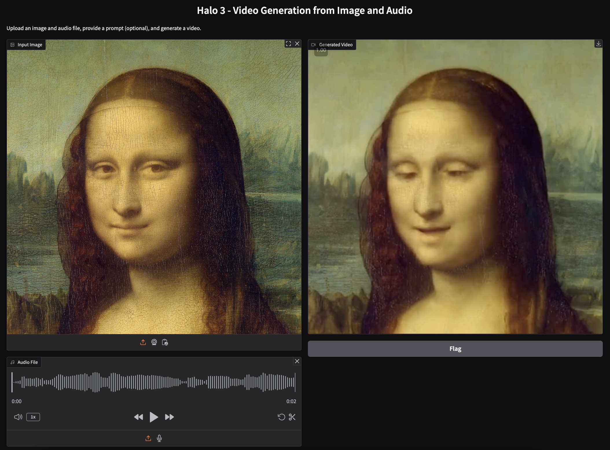
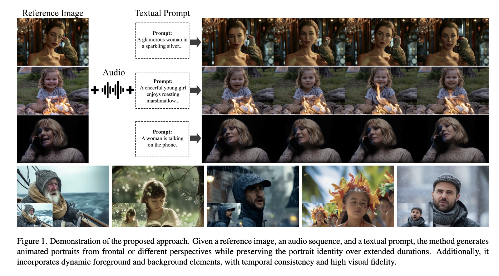

# AI-Research-Paper-Hallo3-
This is a place to study the AI model 'Hallo3'. 
- Authors: Jiahao Cui, Hui Li, Yun Zhan, Hanlin Shang, Kaihui Cheng, Yuqi Ma, Shan Mu, Hang Zhou, Jingdong Wang, Siyu Zhu
- Submitted on 1 Dec 2024 (v1), last revised 4 Jan 2025 (this version, v3)
- 'Hallo3' Paper link -> [Research Paper](https://arxiv.org/abs/2412.00733v3)
- 'Hallo3' github -> [github](https://fudan-generative-vision.github.io/hallo3)
---

# Title : Highly Dynamic and Realistic Portrait Image Animation with Diffusion Transformer Networks

## Abstract
- Existing methodologies for animating portrait images face significant, which are as follows:
  - handling Non-frontal perspectives (비정면적 관점 처리)
  - rendering dynamic objects around the portrait (초상화 주위의 동적 객체 렌더링)
  - generating immersive, realistic backgrounds (몰입감 있고 현실적인 배경 생성)
- The authors stated that:
  - we design an identity reference network consisting of a causal 3D VAE combined with a stacked series of transformer layers,
    ensuring consistent facial identity across video sequences. 
    (기존 U-NET 방식에서 (3D VAE+stacked series of transformer layers) 방식으로 바꿔서 진행)
- The approach we proposed demonstrates substantial improvements. 
  ("substantial improvments" <-- 🔥)
---
#### Study Log
- U-NET, 3D VAE 이 두개의 모델에 대해 완전히 이해하고 구현한걸 여기에 저장하자 
  - [U-NET](U-NET.md) 
  - [3D VAE](3D-VAE.md)
---
## Introduction

  - Existing portrait image animation have utilized facial landmarkes,3D parametric models,generative adversarial networks(GAN) and diffusion models. 
  ->> However
    - these methods rely on frontal and central face images.
    - making it difficult to handle side, overhead, and low-angle views.
    - they assume a static background, which limits thier ability to effectively reflect dynamic foreground and background changes. 
    
  - The method we used address this issue
    1. We applied a pre-trained DIT-based video generation model to portrait image animation for the first time.
    2. Identity Preservation (3D VAE+트랜스포머 레이어)
    3. Speech Audio Conditioning (오디오를 움직임 제어 정보로 활용)
    4. Video Extrapolation (비디오 외삽)
        
